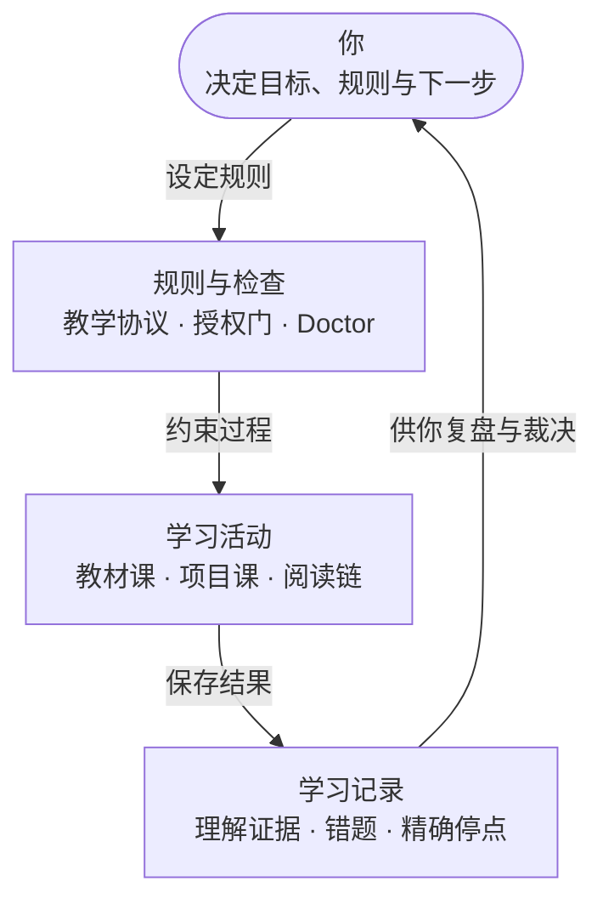
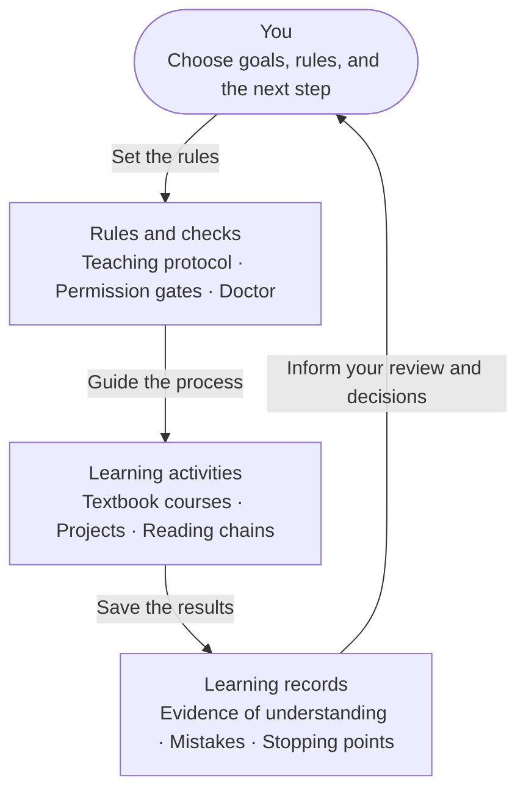

# T2AG

> **正在净室重构 / Clean-room rebuild in progress — 2026-09-22**
>
> T2AG 正在面向 **0.3.0** 进行净室重构，目前处于架构与状态模型设计阶段。
> `0.3.0` 尚未发布；已发行版本仍为 `0.2.4`。详见[更新计划](#roadmap)。
>
> T2AG is undergoing a clean-room rebuild for **0.3.0**, currently in architecture
> and state-model design. `0.3.0` has not been released; the released version remains
> `0.2.4`. See the [development plan](#roadmap).

T2AG 是考你而不是替你答的 AI 学习框架。你的错题、你证明过的理解、每一次裁决，都存在
归你所有的纯文本文件里——Claude Code、Codex 或任何 agent 都能读，随时可带走。考试从
你自己的材料盲提取、签认计分、可重放；自带 Doctor 全仓自检；环上的裁决者是你，不是
模型。本仓只提供空骨架，不携带真实学生数据。

T2AG is an AI learning harness that tests you instead of answering. Your mistakes,
your proofs of understanding, and every verdict live in plain-text files you own —
readable by Claude Code, Codex, or any agent, and portable between them. Exams are
blind-extracted from your own materials, scored under a countersign protocol, and
replayable; a built-in doctor checks the whole instance; the judge in the loop is
you, not the model. This release contains empty skeletons, not student data.

## 工作原理 / How it works

以下展示现行 `0.2.4` 的工作方式；`0.3.0` 的重构方向见[更新计划](#roadmap)。

**你定规则 → 按规则学习 → 留下证据 → 回到你来裁决。**



- **裁决在你**：学习证据帮助你判断，是否继续仍由你决定；考试只是考核工具之一。
- **规则持续修订**：文档定义教学协议；检查注册表、授权门、问题闭包与 Doctor 支持执行，
  规则随你的裁决迭代。
- **记录归你**：台账只追加，全部状态保存在你磁盘上的纯文本文件里，任何 agent 都能读取。

<details>
<summary>English — How it works</summary>

This describes the current `0.2.4` workflow. See the [development plan](#roadmap)
for the `0.3.0` rebuild.

**You set the rules → learn within them → keep the evidence → make the next decision.**



- **You decide**: evidence informs your judgment; you decide whether to continue.
  Exams are one assessment tool among others.
- **Rules evolve**: documents define the teaching protocol. The check registry,
  permission gates, problem closure, and Doctor support its execution; rules
  evolve through your decisions.
- **You own the records**: ledgers are append-only. All state lives in plain-text
  files on your disk, readable by any agent.

</details>

| 版本 / Edition | 入口 / Entry | 生成来源 / Generated from |
|---|---|---|
| 中文（正本） | [`zh/README.md`](zh/README.md) | Skeleton 0.2.4 development, commit `18e9f23` |
| English | [`en/README.md`](en/README.md) | Skeleton EN 0.2.4 development, commit `9028f27` |

> **版本状态 / Version status**：`0.2.4` **已发行**（2026-08-31）：
> `implementation_status = complete`、`candidate_review = passed`、
> `release_qualification = finalization_delta_passed`；发行物与校验和见
> [Release v0.2.4](https://github.com/lungstrahv/T2AG/releases/tag/v0.2.4)。`0.2.3` 为前一发行版。
> `0.2.4` is **released** (2026-08-31): `implementation_status = complete`,
> `candidate_review = passed`, `release_qualification = finalization_delta_passed`.
> Artifacts and checksums:
> [Release v0.2.4](https://github.com/lungstrahv/T2AG/releases/tag/v0.2.4). `0.2.3` is the previous release.

<a id="roadmap"></a>

## 更新计划 / Development plan

更新于 **2026-09-22**。目标版本：**0.3.0**；当前阶段：**设计中，尚未进入实现与真实数据迁移**。
本节公开重构方向与阶段进展，发布日期尚未确定。

Updated **2026-09-22**. Target: **0.3.0**. Current phase: **design; implementation
and migration of real data have not started**. This plan describes the direction
and progress of the rebuild; no release date has been set.

### 重构目标 / Rebuild goals

这里的“净室重构”指从学习需要、核心行为与真实使用证据重新设计教学系统。
`0.2.4` 提供需求、失败案例和迁移输入；新系统不沿用旧目录、旧流程或旧 Doctor 检查清单作为结构模板。
目标是保留核心学习行为与学生数据，重建实现结构，降低维护负担，让学习、存证与精确恢复成为清晰的最小闭环。

“Clean-room rebuild” here means redesigning the teaching system from learning
needs, core behavior, and evidence from actual use. `0.2.4` supplies requirements,
failure cases, and migration inputs; its directories, workflows, and Doctor
checklist are not the blueprint. The goal is to preserve core learning behavior
and student data while rebuilding the implementation, reducing maintenance work,
and making learning, evidence capture, and precise recovery a clear minimal loop.

- **学生控制下一步**：继续学习的许可与学习表现证据分别记录；完成一个学习块与长期掌握分开。
  **Learner control**: permission to continue is distinct from evidence of performance;
  completing a learning block is distinct from long-term mastery.
- **事实可追溯**：设计采用一条追加的权威事件序列，当前视图由其派生并可重建。
  **Traceable facts**: the design uses one append-only authoritative event sequence,
  with current views derived from it and rebuildable.
- **写入前校验**：以 T2AG 自身的写入命令为主校验边界，宿主钩子作为可选的额外保护。
  **Validation before writing**: T2AG's own write command is the primary validation
  boundary; host hooks provide optional additional protection.
- **保留数据再切换**：迁移计划先生成学生持有的冻结交换包，保留原始内容与校验信息，
  再导入新系统并回放验收。**Preserve data before switching**: migration is planned around
  a frozen exchange package held by the learner, preserving original content and
  checksums, followed by import and replay validation.

### 阶段进展 / Milestones

| 阶段 / Stage | 状态 / Status |
|---|---|
| 功能图与结构种类 / Functional map and structural types | 已冻结 / Frozen |
| 状态模型与精确停点 / State model and precise stopping points | 首稿已交并复核，待讨论与冻结 / Draft delivered and reviewed; discussion and freezing pending |
| 其余行为场景展开与不变量表定稿 / Remaining behavior scenarios and finalized invariant table | 后续阶段，未开始 / Planned; not started |
| 授权门、写入边界与校验 / Authorization gates, write boundaries, and validation | 后续阶段，未开始 / Planned; not started |
| 迁移契约、载体与语言选型 / Migration contract, storage format, and implementation language | 后续阶段，未开始；选型待前置设计完成 / Planned; selection follows the preceding design work |
| 最小闭环实现、迁移验收与切换 / Minimal working loop, migration validation, and cutover | 后续阶段，未开始 / Planned; not started |

最小闭环的验收目标是：**建学生 → 建课程与来源 → 选活动 → 启动或精确恢复 → 完成一块 →
存证据 → 写停点 → 关会话 → 再次精确恢复**。课程组、多发行版、云同步和复杂发布治理等扩展，
留在这个闭环之后。

The first working loop must support: **create a learner → create a course and
sources → select an activity → start or resume precisely → complete one block →
save evidence → record the stopping point → close the session → resume precisely
again**. Extensions such as course groups, multiple editions, cloud sync, and
complex release governance follow this loop.

### 对现有用户的影响 / For existing users

当前公开代码与安装说明仍对应 `0.2.4`。上述内容是 `0.3.0` 的设计与实施计划，尚不提供
可执行的升级步骤；迁移工具、兼容范围与切换说明将在相应阶段验证后公布。

The public code and installation instructions still correspond to `0.2.4`. The
plan above describes future `0.3.0` work and does not yet provide executable
upgrade steps. Migration tooling, compatibility scope, and cutover instructions
will be published after validation at the relevant stage.

## 下载与初始化 / Download and initialize

GitHub **Code → Download ZIP** 会下载一个同时包含完整 `zh/` 与 `en/` 的双语发行源。
它只是安装来源；最终学习目录不是这个解压目录。

GitHub **Code → Download ZIP** downloads one bilingual Release Source containing
the complete `zh/` and `en/` editions. It is installation material, not the live
learning folder.

1. 下载并解压 ZIP（或 clone 本仓）。
2. 用 AI agent 打开发行源根目录并发送 `T2AG`。
3. Agent 必须无默认地询问：

   ```text
   Choose your language / 选择你的语言：
   1. 中文
   2. English
   ```

4. Agent 只把所选版本复制为发行源同级的 `t2ag/`，并在 `t2ag/` 中初始化。
5. 首次资料只有五项且全部可选：称呼、学习水平、是否引入参考培养方案、学习兴趣、自我介绍。
   全部跳过时使用公开默认值，不再追问。中文版初始讲解语言为中文，英文版为英文。
6. 初始化和验证成功后，Agent 才单独询问是否删除发行源。没有明确确认就保留。

1. Download and extract the ZIP (or clone this repository).
2. Open the Release Source root with an AI agent and send `T2AG`.
3. Answer the no-default bilingual language prompt shown above.
4. The agent copies only that edition into a sibling `t2ag/` and initializes there.
5. First run offers five optional profile items: preferred name, learning level,
   reference curriculum preference, learning interests, and self-introduction.
   Skipping all five uses public defaults without follow-up. English edition
   teaching is English; Chinese edition teaching is Chinese.
6. Only after successful initialization and verification may the agent separately
   ask whether to delete the Release Source. No confirmation means keep it.

安装期间可能暂时存在两个目录：浏览器命名的发行源，以及固定名为 `t2ag` 的个人实例。
用户始终只在 `t2ag` 中学习。发行源可以留作安装包，也可以在单独确认后删除。

Two folders may temporarily coexist: the browser-named Release Source and the
Personal Instance named exactly `t2ag`. The learner uses only `t2ag`. The Release
Source can be kept as installation material or deleted after separate confirmation.

完整的人工命令、路径核验与 AI 自动执行契约见 [`INSTALL.md`](INSTALL.md)。
See [`INSTALL.md`](INSTALL.md) for manual commands, path checks, and the agent route.

## 让 AI agent 自动执行 / Agent prompt

> 完整读取本目录的 `INSTALL.md`，严格使用无默认的双语语言问题。把我明确选择的版本复制
> 到发行源同级、名称精确为 `t2ag` 的新目录，在那里完成首次初始化与验证。不得覆盖已有
> `t2ag`。初始化成功后再单独问我是否删除发行源；没有明确确认就保留。

> Read `INSTALL.md` in full. Use its bilingual language question with no default.
> Copy only my explicit edition choice into a new sibling directory named exactly
> `t2ag`, then initialize and verify it there. Do not overwrite an existing `t2ag`.
> After success, ask separately whether to delete the Release Source; keep it unless
> I explicitly confirm deletion.

## 许可证 / Licensing

代码采用 [Apache-2.0](LICENSE)，散文采用 [CC BY-SA 4.0](LICENSE-DOCS.md)；路径边界见
[`LICENSING.md`](LICENSING.md)，归属与声明见 [`NOTICE`](NOTICE)。

Code is licensed under [Apache-2.0](LICENSE), prose under
[CC BY-SA 4.0](LICENSE-DOCS.md). See [`LICENSING.md`](LICENSING.md) for path
boundaries and [`NOTICE`](NOTICE) for attribution and notices.

---

*Maintained by [mikp from t2ac](https://github.com/lungstrahv)*
