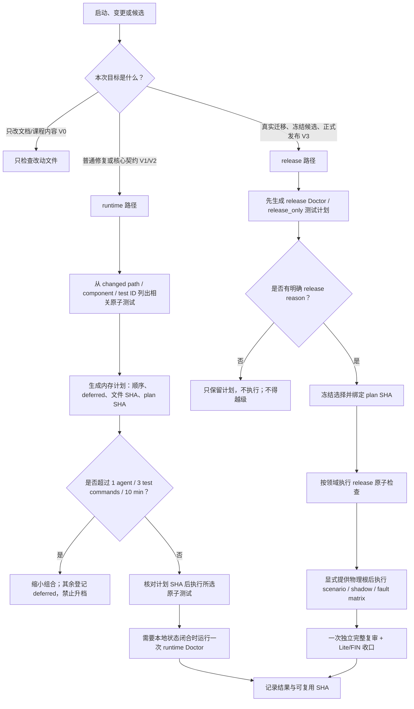

# 标准检测流程（validation_flow）

**保护级别**：core-playbook

本流程是 Main、Skeleton、Lite 共同携带的基础能力。Main 与 Skeleton 可以生成和执行计划；
Lite 只读展示同一控制文件、流程和原子检测代码，不在 Lite 内执行。

## 一、流程树



Doctor 自身的原子结构如下；`release` 继承全部 `runtime`，不是第三套重复实现：

```text
Doctor
├─ runtime（默认、启动安全）
│  ├─ structure / version_profile / skin / authorization
│  ├─ course_discovery
│  │  ├─ groups / activity_ledgers / question_banks
│  │  ├─ knowledge_ledgers / project_verification / exercises
│  │  ├─ teacher_contract
│  │  │  └─ memory_pointers
│  │  └─ working_pages  （Snapshot-only，legacy 已退役）
│  └─ engagements / registry / trading / legacy / cloud_pause
│     └─ context_packet / test_management / course_templates
└─ release（显式、继承 runtime）
   ├─ flow_guide / handoff / cloud / derived_tools
   ├─ migration_020 / migration_021 / activity_migration_021
   ├─ reading_bridge / core_playbooks / candidate_replay
   └─ tracked_environment / dirty_tree
```

实际顺序、依赖和完整 ID 以 `70_tools/validation_workflow.json` 为唯一控制源；图只解释该
控制源，不另立真相。

## 二、计划与执行

Doctor 启动检查会先打印有序计划和 SHA，再执行固定的完整 runtime 组合：

```powershell
python -B main/70_tools/t2ag_doctor.py --profile runtime
```

只查看或组合 Doctor 原子项：

```powershell
python -B main/70_tools/t2ag_doctor.py --list-checks
python -B main/70_tools/t2ag_doctor.py --profile runtime --check runtime.memory_pointers --plan-only
```

定向测试必须先生成计划，再以同一 SHA 执行。可以按改动路径、组件或稳定 test ID 组合：

```powershell
python -B main/70_tools/t2ag_test.py --test activity.close --test activity.close_roundtrip --tier fast --plan-only
python -B main/70_tools/t2ag_test.py --test activity.close --test activity.close_roundtrip --tier fast --execute-plan <PLAN_SHA>
```

release 计划可以只读生成；执行必须同时提供匹配的计划 SHA 和控制文件登记的 release
reason。完整 `release_suite` 永远只生成聚合计划，不能一条命令自动跑完：

```powershell
python -B main/70_tools/t2ag_doctor.py --profile release --plan-only
python -B main/70_tools/t2ag_doctor.py --profile release --release-reason formal_release --execute-plan <PLAN_SHA>
python -B main/70_tools/t2ag_test.py --component release_suite --tier release_only --plan-only
```

## 三、防越级规则

- 未明确进入真实迁移、冻结候选、版本升级、完整复审或正式发布时，profile 固定为 runtime，
  测试档位不得高于受影响路径需要的 fast/deep。
- `release` 不是“更保险的日常检查”。没有合法 reason 或计划 SHA 时只能列计划，不能执行。
- 普通计划超过三个测试命令时必须缩小选择，其余项进入 deferred；不得通过切换到
  `release_only`、全量发现或临时测试文件绕过预算。
- Doctor 原子项和测试原子项是两套相互配合的清单：Doctor 检查项目状态，测试验证实现
  行为。Doctor 不因测试数量增加而扩张，测试选择器也不隐式调用 release Doctor。
- finding 修复先更新静态影响闭包和定向计划；只有最终冻结候选才统一运行一次完整 V3。
- Lite、`.venv`、旧 recovery/staging、教材和图片默认不进入普通选择范围。

任何工具修改上述默认档位、预算、release reason、plan-only 或 SHA 绑定规则，都必须同时
修改控制文件、流程图和基础原子测试；三形态分叉在 release parity 中阻断。

## 四、V 级细则与发布前提（canonical，自宪法 §6.1 下沉 2026-08-08/EV-0020）

- finding 修复先做完整后续路径静态审查与针对性回归；不得每修一个小点就重跑完整矩阵。
  SHA 未变且依赖未受影响的证据允许复用。完整独立复审只针对冻结候选执行一次，修复期
  使用受影响项 delta review，最终候选再统一执行一次完整 V。
- 普通验收不扫描 .venv、Lite、旧 recovery/staging、教材或图片。
- 施工期 dirty/Lite 分叉只描述候选状态，不解除真正 FAIL；仅 G/FIN 可据三发行一致性
  宣称正式发布。
- runtime/release Doctor 分层、测试选择器、两个控制清单与流程树是 Main/Skeleton/Lite 的
  共同基础内容；Main/Skeleton 可执行，Lite 只读携带；缺少 `BASE_VALIDATION_FILES` 任一项
  即为结构 FAIL。定向 Doctor 与 release 执行必须绑定 plan SHA。
- 发布前必须满足：Main/Skeleton release doctor `0 FAIL`、Lite 投影 parity 通过、迁移二次
  检查零待办、journal index 零漂移、Skeleton 空实例再生通过、独立审查通过。

