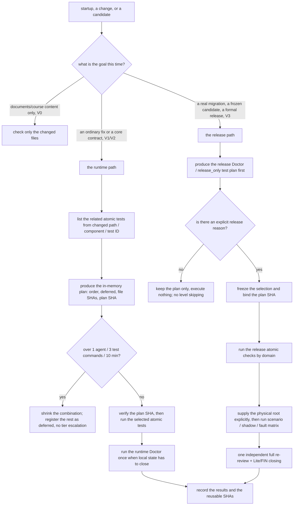

# The standard check flow (validation_flow)

**Protection level**: core-playbook

This flow is a base capability carried by Main, Skeleton, and Lite alike. Main and Skeleton can generate
and execute a plan;
Lite only displays the same control file, flow, and atomic check code read-only, and executes nothing.

## 1. The flow tree



Doctor's own atomic structure is as follows; `release` inherits all of `runtime` and is not a third
duplicate implementation:

```text
Doctor
├─ runtime (default, startup-safe)
│  ├─ structure / version_profile / skin / authorization
│  ├─ course_discovery
│  │  ├─ groups / activity_ledgers / question_banks
│  │  ├─ knowledge_ledgers / project_verification / exercises
│  │  ├─ teacher_contract
│  │  │  └─ memory_pointers
│  │  └─ working_pages  (Snapshot-only; the legacy path is retired)
│  └─ engagements / registry / trading / legacy / cloud_pause
│     └─ context_packet / test_management / course_templates
└─ release (explicit, inherits runtime)
   ├─ flow_guide / handoff / cloud / derived_tools
   ├─ migration_020 / migration_021 / activity_migration_021
   ├─ reading_bridge / core_playbooks / candidate_replay
   └─ tracked_environment / dirty_tree
```

The real order, the dependencies, and the full IDs are governed solely by
`70_tools/validation_workflow.json`; the diagram explains that control source and does not establish a
second truth.

## 2. Plan and execution

Doctor's startup check first prints the ordered plan and its SHA, then executes the fixed full runtime
combination:

```powershell
python -B main/70_tools/t2ag_doctor.py --profile runtime
```

To view or combine Doctor atoms only:

```powershell
python -B main/70_tools/t2ag_doctor.py --list-checks
python -B main/70_tools/t2ag_doctor.py --profile runtime --check runtime.memory_pointers --plan-only
```

A targeted test must produce a plan first and then execute under the same SHA. It may be combined by
changed path, by component, or by stable test ID:

```powershell
python -B main/70_tools/t2ag_test.py --test activity.close --test activity.close_roundtrip --tier fast --plan-only
python -B main/70_tools/t2ag_test.py --test activity.close --test activity.close_roundtrip --tier fast --execute-plan <PLAN_SHA>
```

A release plan may be generated read-only; executing it requires both a matching plan SHA and a release
reason registered in the control file. The full `release_suite` only ever generates an aggregate plan and
can never be run to completion by a single command:

```powershell
python -B main/70_tools/t2ag_doctor.py --profile release --plan-only
python -B main/70_tools/t2ag_doctor.py --profile release --release-reason formal_release --execute-plan <PLAN_SHA>
python -B main/70_tools/t2ag_test.py --component release_suite --tier release_only --plan-only
```

## 3. The anti-escalation rules

- Unless a real migration, a frozen candidate, a version bump, a full re-review, or a formal release has
  been entered explicitly, the profile is fixed at runtime,
  and the test tier must not exceed the fast/deep the affected path requires.
- `release` is not "a safer everyday check". Without a legal reason or a plan SHA, it may only list a
  plan, never execute.
- When an ordinary plan exceeds three test commands, the selection must be shrunk and the rest becomes
  deferred; the budget must never be evaded by switching to
  `release_only`, by full discovery, or by a temporary test file.
- Doctor atoms and test atoms are two cooperating manifests: Doctor checks project state, tests verify
  implementation behaviour. Doctor does not expand because the test count grew, and the test selector
  never invokes the release Doctor implicitly.
- A finding fix updates the static impact closure and the targeted plan first; only the final frozen
  candidate runs a full V3 once.
- Lite, `.venv`, old recovery/staging, textbooks and images are outside ordinary selection scope by
  default.

Any tool change to the default tier, the budget, the release reason, plan-only, or the SHA binding rules
above must change the control file, the flow diagram, and the base atomic tests together; a fork among
the three forms is blocked in release parity.

## 4. V-level detail and release preconditions (canonical; sunk from constitution §6.1 on 2026-08-08 / EV-0020)

- A finding fix first performs a full static review of the downstream path plus a targeted regression;
  the full matrix must not be re-run for every small fix.
  Evidence whose SHA has not changed and whose dependencies were unaffected may be reused. A full
  independent re-review runs once, against the frozen candidate; during the fix period a delta review of
  the affected items is used, and the final candidate then runs one full V.
- An ordinary acceptance does not scan .venv, Lite, old recovery/staging, textbooks, or images.
- A dirty/Lite fork during construction only describes candidate state; it does not lift a real FAIL.
  Only G/FIN may declare a formal release on the basis of three-release consistency.
- The runtime/release Doctor tiers, the test selector, the two control manifests, and the flow tree are
  content shared by Main/Skeleton/Lite; Main/Skeleton can execute them, Lite carries them read-only, and
  a missing item from `BASE_VALIDATION_FILES`
  is a structural FAIL. A targeted Doctor run and a release run must both bind a plan SHA.
- Before a release, all of these must hold: Main/Skeleton release doctor `0 FAIL`; Lite projection parity
  passes; the migration second check has zero to-dos; the journal index has zero drift; the Skeleton
  empty-instance regeneration passes; and the independent review passes.
