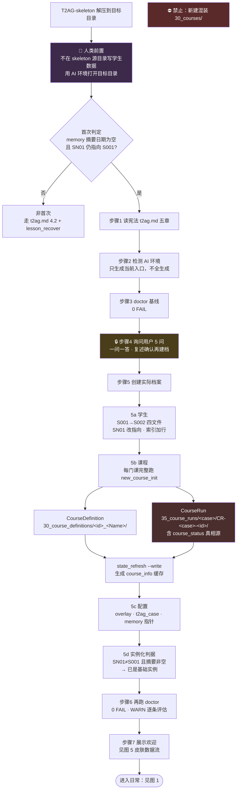
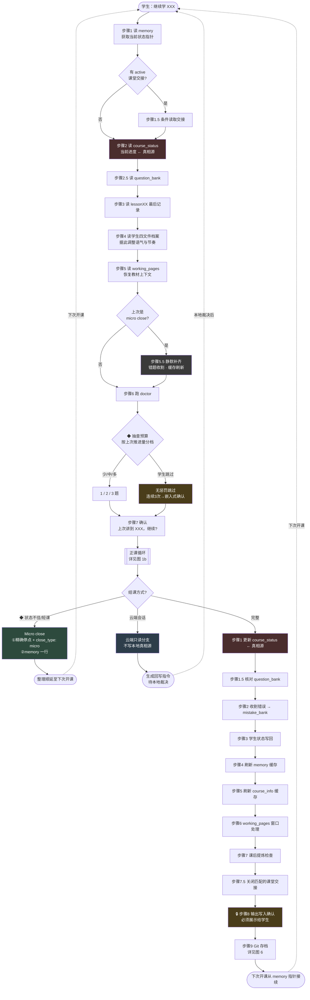
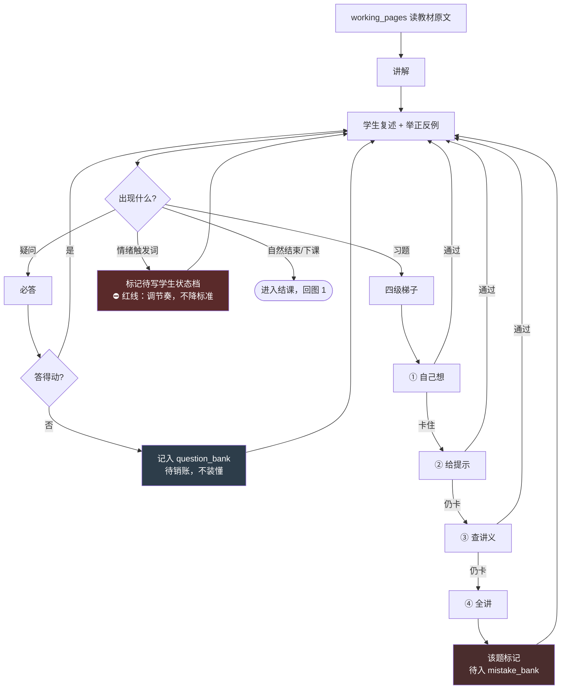
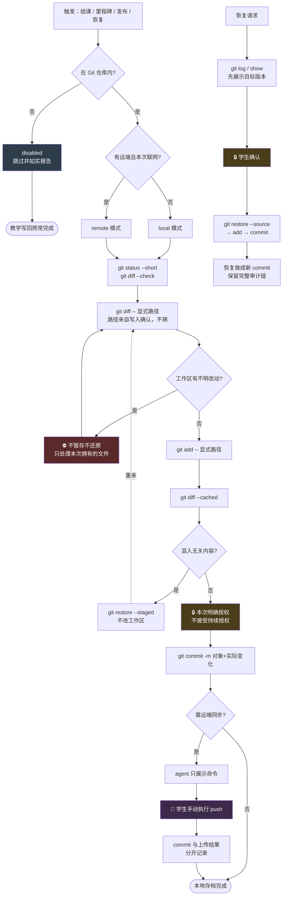
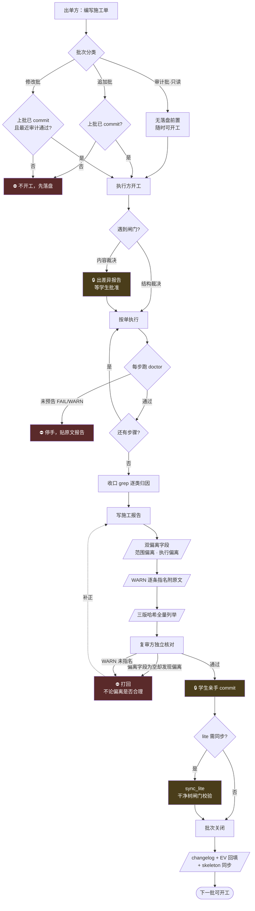

# T2AG 功能流程图（t2ag_flow.md v2）

**保护级别**：core-playbook（跨发行版保留）

> 本文件回答**"系统跑起来是什么样"**，与 `t2ag.md`（规则）、`domain_model.md`（对象）、
> `pattern_retire_loop.md`（复利模式）互补。
> **规则与本图冲突时以权威文件为准，并修本图。**
> **本文件是视图，不是真相源**：任一步骤的权威描述在对应 playbook。
>
> **格式双轨（判据）**：有分支/循环/闸门的**过程** → mermaid；表达层级或权威的**静态拓扑** → ASCII（位置即语义，mermaid 自动布局做不到）。
> **提取标记**：每图以 `<!-- FLOW:xxx -->` 开始、`<!-- /FLOW:xxx -->` 结束，供 HTML 生成器按块提取。标记行勿删。

---

## 图 0 · 骨架解压与首次启动

<!-- FLOW:first_run -->

<!-- /FLOW:first_run -->

> **agent 职责 = 填充内容，不是创建目录**（骨架已预建全部容器）。
> 现顶层结构：`00_core` `10_case` `12_activity_records` `15_curricula` `20_groups` `25_general`（冻结）`30_course_definitions` `35_course_runs` `40_field_practices` `50_playbook` `60_journal` `70_tools` `skin` `cloud` `bin`。
> （`30_courses/` 仅空壳兼容，待 M5 拆除；`40_practices/` 已退场。）

---

## 图 1 · 一次教学会话的完整生命周期

<!-- FLOW:panorama -->

<!-- /FLOW:panorama -->

> **中断兜底**：仪式没走完 → 下次开课 doctor 必报不一致。
> **三条设计原则的可视化**：红色两格＝`course_status` 唯一真相源（一读一写）｜Micro close 是一等分支不是例外（"五分钟也算数"）｜跳过无惩罚但连续 3 次触发确认（弹性有底）。

---

## 图 1b · 正课循环内部（教学法）

<!-- FLOW:teaching_loop -->

<!-- /FLOW:teaching_loop -->

> 四级梯子的意义：**第 4 级被触发本身就是信号**——该题必入错题库，因为学生独立走不完。
> 疑问答不动时记入 `question_bank` 待销账，而不是含糊带过——这条是台账机制的入口（见 `pattern_retire_loop.md` 部件节）。

---

## 图 2 · 权威链数据流（谁是源，谁是缓存）

<!-- FLOW:authority_chain -->
```text
                    结课仪式步骤1（唯一人工写入口）
                              │
                              ▼
        ┌──── course_status.md（真相源 / 每个 CourseRun 一份）────┐
        │  35_course_runs/<case>/CR-<case>-<id>/course_status.md   │
        │  只在结课时写；任何冲突一切以它为准                       │
        └──────────┬─────────────────────────────┬────────────────┘
                   │                             │
          仪式步骤4 │                             │ 仪式步骤5
                   ▼                             ▼
        memory 指针/速览（缓存）        course_info 进度列（缓存）
        00_core/t2ag_memory.md          10_case/course_info.md
                   │                             ▲
                   │                             │ state_refresh --write
                   │                             │ （机器写，GENERATED 块）
          开课步骤1 │                    ┌────────┴────────┐
              被读取 │                    │ 块内永不手写      │
                   ▼                    │ 块外永不脚本改    │
              doctor 校验三级一致 ────────┴─────────────────┘
              （不一致 = 上次仪式未走完）

  ── 旁路数据流（各自独立的复利回路，见 pattern_retire_loop.md）──

  lesson 错误 ──仪式步骤2──→ mistake_bank ──开课步骤6──→ 抽查复测
  课堂疑问   ──随时────────→ question_bank ─开课步骤2.5─→ 销账
                                    └──集合层沉淀──→ reasoning_patterns（积累）
  工具故障   ──随时────────→ problemlog ────→ 修 playbook / 工具
  情绪触发词 ──仪式步骤3──→ students 档案 ──开课步骤4──→ 调节奏语气
  真实行动   ──随时────────→ FieldPractice evidence ──→ Praxis 课程消费
```
<!-- /FLOW:authority_chain -->

> **为什么这张图用 ASCII**：源在中、缓存在下、旁路横走——**位置即语义**，"谁是源"不靠读标签靠看位置。这是 mermaid 自动布局做不到的。

---

## 图 3 · 周期性回路（会话之外的心跳）

<!-- FLOW:cycles -->
```text
频率          回路                                          载体
────────────────────────────────────────────────────────────────────────
每次会话      开课抽查 ←──→ 结课收割                        mistake_bank
              （衰减型复利回路，日频）

随时          疑问记入 ──→ 销账 ──→ 集合层沉淀              question_bank
              （台账 → 积累型回路）                          → reasoning_patterns

按执行参数    小调整 / 循环复盘 → 五问自查                   G 组文件
              （防方案漂移）

每月末+20min  交易月复盘 → 归因标签统计 → 改交易系统         FP-S002-0001
              （衰减型，事前存证）

每月          memory「长期事实」节淘汰                       t2ag_memory.md
              （三周未用 → 下沉留痕）

大调整/期末   课程组评估 → 结组仪式 → 归档 G01 → 建 G02      20_groups/

里程碑末      环境重建验证（按需，非默认删 .venv）           .venv / .tools

版本变更      规则修改 → changelog → memory「最近变更」同步  00_core/

结构批次      工单 → 执行 → 报告 → 复审 → commit            见图 7
```
<!-- /FLOW:cycles -->

---

## 图 5 · 皮肤系统数据流（外观层，非教学层）

<!-- FLOW:skin -->
```text
  skin/skin.yaml（全局配置）
    │  active: SK001
    │  registry.SK001: SK001_default
    ▼
  skin/SK001_default/skin.yaml（皮肤元数据）
    │  welcome_msg / art_file / style
    ▼
  输出：欢迎语 + ASCII 艺术画面        ← first_run 步骤7 / 首次会话

  doctor check_skin_system（七条）
  ┌───────────────────────────────────────────┬──────┐
  │ 无全局 skin.yaml（未初始化）              │ WARN │
  │ 缺 active                                 │ FAIL │
  │ active 未在 registry.*                    │ FAIL │
  │ 文件夹或皮肤 skin.yaml 不存在             │ FAIL │
  │ art_file 指向文件不存在                   │ FAIL │
  │ SK* 目录未登记 registry                   │ WARN │
  │ welcome_msg 含指令词（必须/规则/禁止…）   │ WARN │  ← 防外观后门
  └───────────────────────────────────────────┴──────┘

  注：main 与 skeleton 的 art_file 允许分叉（骨架默认欢迎图 vs 主实例个人 art），
      属 H4 期望分叉清单登记项，非漂移。
```
<!-- /FLOW:skin -->

> 最后一条检查值得单说：**皮肤是外观，不得携带指令**——`welcome_msg` 里出现"必须/规则/进度/禁止"等词即 WARN，防止有人（或某个模型）借外观层夹带行为指令。

---

## 图 6 · Git 工作流

<!-- FLOW:git -->

<!-- /FLOW:git -->

> **三条永不出现在图上的命令**：`git reset --hard`｜`git clean -fd`｜`git push --force`——agent 禁止自行使用，冲突与历史改写一律停下说明。
> **核心不变式**：Git 是保护层不是真相源。disabled / 无网络 / 无快照都不阻断开课、教学写回或结课。

---

## 图 7 · 批次治理流程（系统自身的修改流程）

<!-- FLOW:batch -->

<!-- /FLOW:batch -->

> 细则见 `50_playbook/batch_workorder_spec.md`。
> **打回条件的设计意图**：让诚实声明成为成本最低的选项——偏离几乎总有好理由，静默才是问题。

---

## 角色视角速查

| 角色 | 负责 |
|---|---|
| **学生** | 说"继续学 X" / 提问 / 说"下课" / 内容裁决与授权 / 亲手 commit |
| **agent** | 图 0 首次启动 + 图 1、1b 全流程 + 图 3 中除学生评价外的一切 |
| **doctor** | 图 2 一致性 + memory 节预算 + 断链 + venv/env + 版本号 + 图 5 皮肤七检 |
| **文件** | 记住一切——**agent 可以换，图 0–7 不变** |

---

## 维护约定

1. **本图是视图**：与权威文件冲突时改本图，不改权威文件；
2. **提取标记勿删**：`<!-- FLOW:xxx -->` 供 HTML 生成器按块提取，删除会导致 guide 页面缺块；
3. **数字勿写死**：不再写"15 个 playbook""9 个文件"等会过期的计数（旧版教训）；
4. **图号即成稿**：changelog 曾记"图 6 含子型分流"，删除前最终文件实际只有图 0–5，属登记与现实脱节；**v2 以本文件实际图号为准**（0、1、1b、2、3、5、6、7；无图 4，其内容并入"角色视角速查"）。
