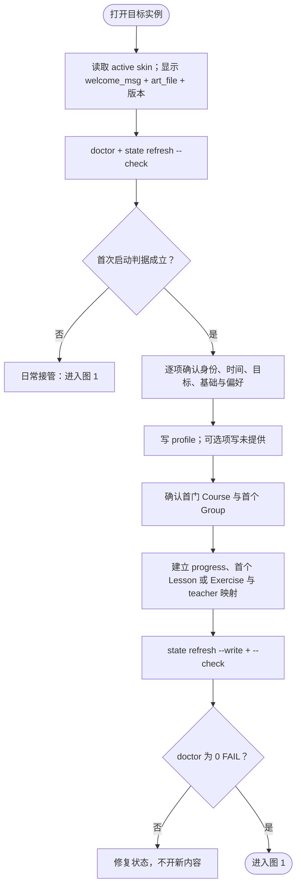
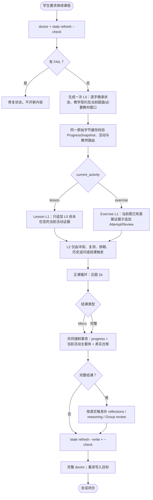
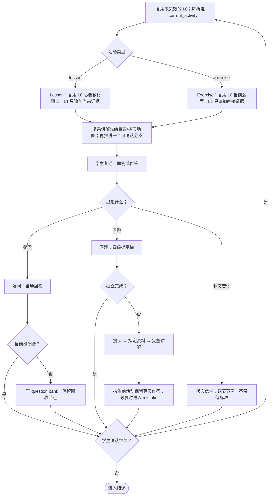
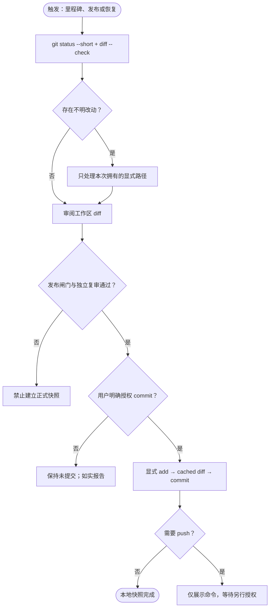
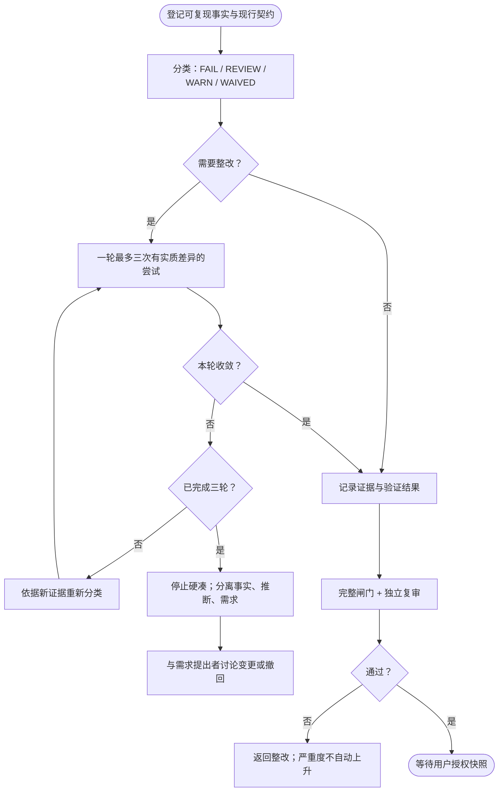
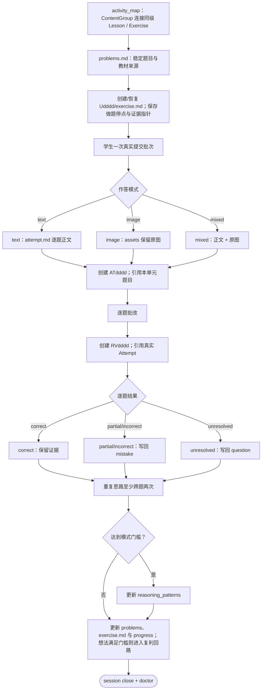

# T2AG 0.2.0 功能流程图

**保护级别**：core-playbook

> 本文件是 `t2ag.md`、domain model 与各 playbook 的派生视图，不单独立法。
> 有分支、循环和闸门的过程使用 Mermaid；静态权威拓扑使用 ASCII。
> 每图的 `FLOW` 标记供离线 HTML 指南生成器提取，不能删除或复用。

## 图 0 · 首次启动

<!-- FLOW:first_run -->

<!-- /FLOW:first_run -->

首次判据是：profile 未初始化、仍有必填占位符，或 memory 上次课日期为 `—`。
Skeleton 不预填真实实例，也不自动创建 `.venv`、课程或 Engagement。

## 图 1 · 一次教学会话

<!-- FLOW:panorama -->

<!-- /FLOW:panorama -->

Cloud 为 `paused` 时只跳过移动端投影，不跳过本地写回。课程进度只写 `progress.md`，
memory 与 learning path 都由 state refresh 生成。

## 图 1b · 正课循环

<!-- FLOW:teaching_loop -->

<!-- /FLOW:teaching_loop -->

每个概念、例题和跨节点动作等待学生确认。多块讲解的地图标明目标、对象类型、依赖关系
和当前分支，但不替代理解确认；新 Exercise 的未授权地图不得泄露方法或子目标。提示
强度可以变化，对错标准不能变化。

## 图 2 · 权威链

<!-- FLOW:authority_chain -->
```text
course.md ─────────────── 课程内容、教材与教学约束
progress.md ───────────── 当前课程进度唯一真相源
      │
      └─ state_refresh ──→ memory / learning_path / Group view（GENERATED 缓存）

profile ───────────────── 学生稳定参数与偏好
Group plan/calendar ───── 容量、时间与结组阈值
Group review ──────────── 组合层证据
teacher overlay ───────── 课程到教师模板的当前映射

当前 Lesson / Exercise ─→ question / mistake ─→ reasoning pattern（达到证据门槛后）
activity_map ───────────→ Lesson / Exercise（同级 LearningActivity）
Exercise ─→ ExerciseProblem ─→ Attempt ─→ Review ──────┘
Engagement evidence ───────────────────────→ 外部治理系统消费或核对

冲突裁决：progress > GENERATED 缓存；外部治理事实 > T2AG 过程注释。
```
<!-- /FLOW:authority_chain -->

## 图 3 · 周期回路

<!-- FLOW:cycles -->
```text
每次会话      开课复测 ↔ 结课收割                    mistake/question
做题学习      Exercise → Attempt → Review → 台账回链          exercises/
D3 / D7       小调整；D7 兼循环复盘                   profile + Group review
每 3 循环     大调整窗口；必须留痕                    Group calendar/review
章节闭合点    陈年知识候选卷；按学生授权模式触发       mistake bank
课程结束      课程复盘与用户确认                       progress + reflections
组阈值满足    结组审查与用户确认                       Group plan/calendar/review
结构整改      三轮×三次 → 分类 → 讨论                  remediation_governance
版本发布      闸门 → 独立复审 → 用户授权 Git 快照      doctor + reports
```
<!-- /FLOW:cycles -->

## 图 5 · 皮肤系统

<!-- FLOW:skin -->
```text
main/80_interface/skin.yaml
  active: SK001
  registry.SK001: SK001_default
        │
        ▼
main/80_interface/SK001_default/skin.yaml
  id / name / welcome_msg / art_file / style
        │
        ▼
欢迎语 + art_file 指向的纯文本画面

doctor：active、registry、目录、元数据、art_file、未登记皮肤、指令词边界
批准分叉：Main/Lite 使用 Inori；Skeleton 使用默认 t2ag 字符画。
```
<!-- /FLOW:skin -->

皮肤只改变外观，不能携带教学命令或改变确认门。

## 图 6 · Git 工作流

<!-- FLOW:git -->

<!-- /FLOW:git -->

禁止自行使用 `reset --hard`、`clean -fd` 或强推。Git 是保护层，不是课程真相源。

Git 证据边界分三层：

```text
evidence checkpoint ── 文件清单 / 指纹 / 测试 / WARN；不要求 Git
recovery checkpoint ── 有界授权的本地中间 commit；只提供恢复能力
release snapshot ───── 完整候选复审 + finalization delta 独立复审绑定的最终 HEAD/tree
```

三者不可互换，`clean ≠ reviewed ≠ released`。默认仍逐次授权；冻结且列举的
`version_campaign` envelope 只能连续覆盖其中的有限 RT1/RT2 checkpoint。push、tag、真实
migration apply、terminal lifecycle 和其他 RT3 不由普通 campaign Git 计划推出。

有界 finalization 使用固定序列：operator stage 精确 allowlist → 独立 reviewer 预审
`expected tree` → operator commit 同一 tree → reviewer 核对 parent/tree/diff → 最后生成不可变
外部报告。PASS 不回写目标仓或施工报告。

## 图 7 · 批次整改治理

<!-- FLOW:batch -->

<!-- /FLOW:batch -->

硬发布门不能 waiver；只有不影响仓内正确性的外部环境问题可记录正式 waiver。

批次调度先选择 `execution_mode`：`independent_batch` 是默认；`version_campaign` 只有在用户
批准包含 campaign ID、版本、基线、included/deferred scope、仓/路径/操作、risk tier、Git
计划、RT3 保留项和失效条件的 envelope 后生效。普通单元跑定向测试；RT2 风险边界、跨发行
同步和最终候选跑完整 Doctor。范围扩张、未知仓/路径、风险升级、未知 FAIL/WARN 或无法证明
影响闭包时立即停手。

首次版本候选必须完整独立复审。后续 finding 只有在输入 manifest 未变且影响闭包可证明时，
才可进入 delta re-review；仍须重跑 Doctor、state、migration、journal、Main/Skeleton 同源、
Lite 投影与最终源指纹等不可分割全局门。

## 图 8 · 习题证据闭环

<!-- FLOW:exercise_loop -->

<!-- /FLOW:exercise_loop -->

图片是原始证据；0.2.0 不伪装实现 OCR 置信度或学生转写确认状态机。

## 维护约定

1. 本文件是视图；与权威冲突时修图。
2. 九个 FLOW ID 必须唯一、开闭配对，并由 doctor 校验。
3. HTML 指南由 `build_guide.py` 生成静态 SVG 与文本回退，不依赖公网 CDN。
4. Main/Skeleton 内容一致；Lite 只从 Main 再生。
